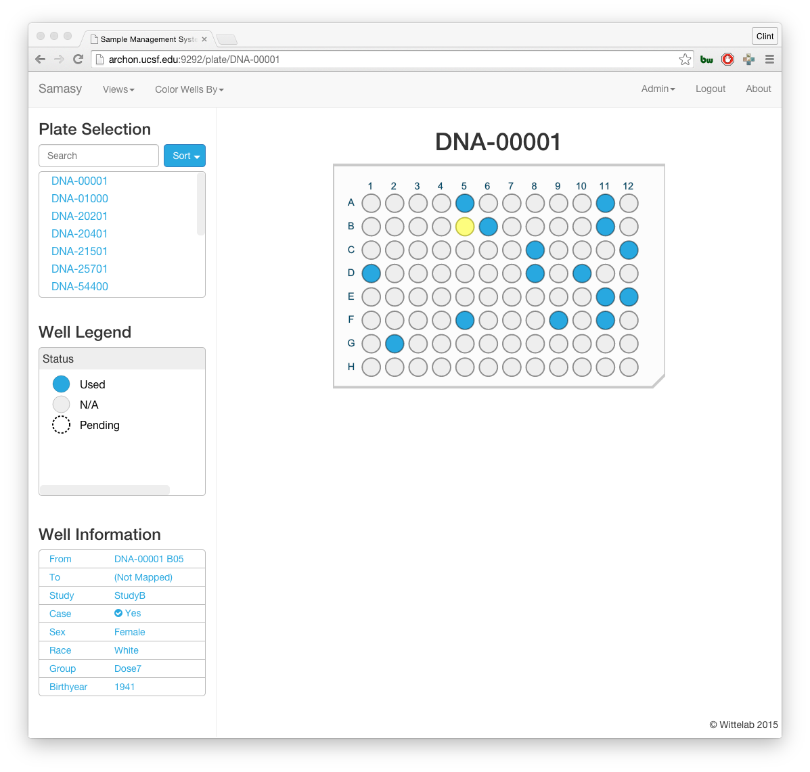

# Samasy
A **Sa**mple **Ma**nagement **Sy**stem for 96 well plates, including robotic transfer.



## Install Dependencies 
### RVM and Ruby 2.0.0
  This software was written and tested with ruby 2.0.0. It is recommened to install this version with rvm if you have a different verison
  ```
  $ gpg --keyserver hkp://keys.gnupg.net --recv-keys 409B6B1796C275462A1703113804BB82D39DC0E3
  $ \curl -sSL https://get.rvm.io | bash -s stable --ruby
  $ source $HOME/.rvm/scripts/rvm
  $ rvm install 2.0.0
  $ rvm use 2.0.0
  ```
### Install System Libraries and Ruby Gems (For a Debian based system)
  ```
  $ sudo apt-get install git libsqlite3-dev
  $ gem install bundler rack
  ```

### 3-Step Code Installation
  ```
  $ git clone https://github.com/wittelab/samasy.git
  $ cd samasy && bundle
  $ rackup
  ```
  You can now point your browser to ```http://localhost:9292``` and follow the on screen directions
