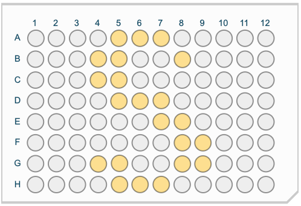
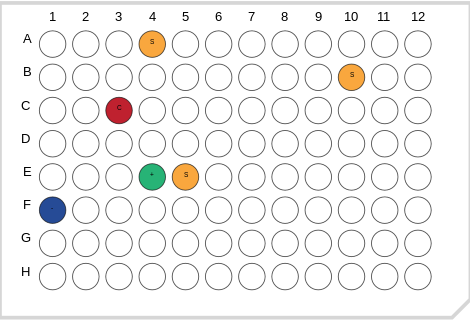

# Samasy
A **Sa**mple **Ma**nagement **Sy**stem for 96 well plates, including robotic transfer.

Sample automation and management is increasingly important as the number and size of population-scale and high-throughput projects grow. This is particularly the case in large-scale population studies where sample size is far outpacing the commonly used 96-well plate format. To facilitate management and transfer of samples in this format, we present Samasy, a web-based application for the construction of a sample database, intuitive display of sample and batch information, and facilitation of automated sample transfer or subset. Samasy is designed with ease-of-use in mind, can be quickly set up, and runs in any web browser. 

*Details about how Samasy is implemented can be found [here](IMPLEMENTATION.md).*  

Please cite the following publication if Samasy is used for an academic project:  
[Biotechniques. 2018 Dec;65(6):357-360](https://www.ncbi.nlm.nih.gov/pubmed/30477330)

## Getting Started 

## Best Method: Docker

Samasy is now dockerized, making installation and running dead simple. To get started, install [docker](https://www.docker.com/) and then run the following commands in your terminal:  
```bash
docker # To test that docker is installed properly, should display docker usage and commands
docker pull ccario83/samasy # To get the samasy docker image
docker run -p9000:9000 ccario83/samasy:latest # To start the app
```
Now point your browser to http://localhost:9000/ and follow the on-screen instructions.

That's it!

## Manual Method
### Install RVM and Ruby 2.0.0
  This software was written and tested with ruby 2.0.0. We recommend installing this version with rvm if you have a another verison on your system:
  ```
  $ gpg --keyserver hkp://keys.gnupg.net --recv-keys 409B6B1796C275462A1703113804BB82D39DC0E3
  $ \curl -sSL https://get.rvm.io | bash -s stable --ruby
  $ source $HOME/.rvm/scripts/rvm
  $ rvm install 2.0.0
  $ rvm use 2.0.0
  ```
### Install System Libraries and Ruby Gems (For a Debian based system)
  ```
  $ sudo apt-get install git libsqlite3-dev # brew install git sqlite3 on a Mac
  $ gem install bundler
  ```

### Install and Run the Application (3-steps)
  ```
  $ git clone https://github.com/wittelab/samasy.git
  $ cd samasy && bundle
  $ rackup
  ```
  You can now point your browser to ```http://localhost:9292``` and follow the on screen directions
  
The interface showing the *Batch view*:


## Lightweight 96-well Plate Labeling and/or Color Coding
See: https://gist.github.com/ccario83/2fc713571e7ddab01486a7f487adeafb  

