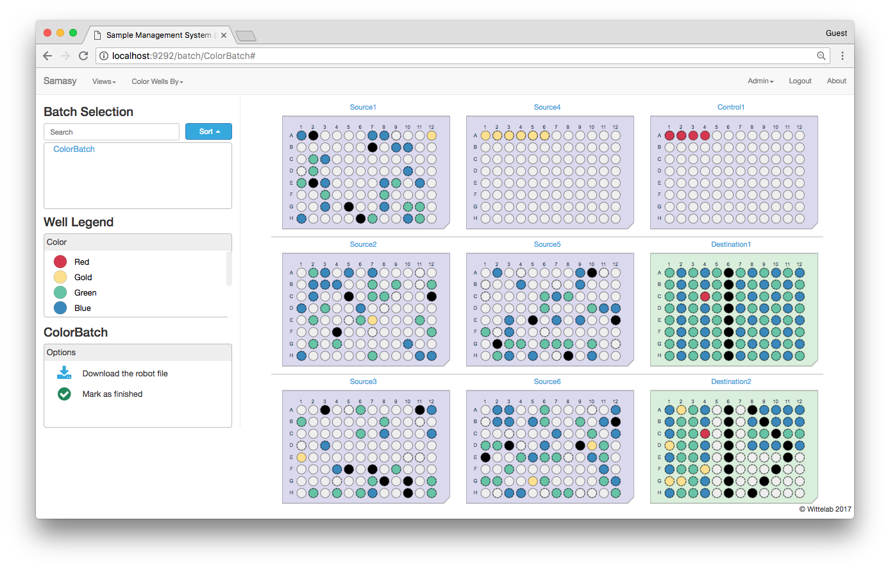

# Samasy
A **Sa**mple **Ma**nagement **Sy**stem for 96 well plates, including robotic transfer.

Samasy is a web app designed to streamline sample tracking and transfers, ideal for handling samples in 96-well plates. It enables you to import data about your samples and plates, allowing for easy visualization of their information. Additionally, Samasy simplifies sample transfers by generating mapping files for liquid handling robots, reducing the likelihood of errors. If your needs are more basic, Samasy can also serve as a straightforward 96-well plate inventory system. Designed with ease-of-use in mind, Samasy can be quickly set up and is accessible through any web browser

*Details about how Samasy is implemented can be found [here](IMPLEMENTATION.md).*  

Please cite the following publication if Samasy is used for an academic project:  
[Biotechniques. 2018 Dec;65(6):357-360](https://www.ncbi.nlm.nih.gov/pubmed/30477330)

## Getting Started 

### Best and Easiest Method: Docker

Samasy is dockerized so getting up and running is simple. Assuming you already have [docker](https://www.docker.com/) installed, run the following commands in a terminal:  
```bash
docker # To test that docker is installed properly, should display docker usage and commands
docker pull ccario83/samasy # To get the samasy docker image
docker run -p9000:9000 ccario83/samasy:latest # To start the app
```
Now point your browser to http://localhost:9000/ and follow the on-screen instructions.  
**NOTE: You'll have to clone this repo if you'd like to use the example data**

That's it!

### Manual Method
#### Install RVM and Ruby 2.0.0
  This software was written and tested with ruby 2.0.0. We recommend installing this version with rvm if you have a another verison on your system:
  ```
  $ gpg --keyserver hkp://keys.gnupg.net --recv-keys 409B6B1796C275462A1703113804BB82D39DC0E3
  $ \curl -sSL https://get.rvm.io | bash -s stable --ruby
  $ source $HOME/.rvm/scripts/rvm
  $ rvm install 2.0.0
  $ rvm use 2.0.0
  ```
#### Install System Libraries and Ruby Gems (For a Debian based system)
  ```
  $ sudo apt-get install git libsqlite3-dev # brew install git sqlite3 on a Mac
  $ gem install bundler
  ```

#### Install and Run the Application (3-steps)
  ```
  $ git clone https://github.com/wittelab/samasy.git
  $ cd samasy && bundle
  $ rackup
  ```
  You can now point your browser to ```http://localhost:9292``` and follow the on screen directions
  
The interface showing the *Batch view*:


## BONUS: Custom coloring of 96-well sample information
You can use the code gist below to print out 96-well plate maps for your lab notebook, or even to place underneath plates to facilitate pipetting!

Check it out: https://gist.github.com/ccario83/2fc713571e7ddab01486a7f487adeafb  

